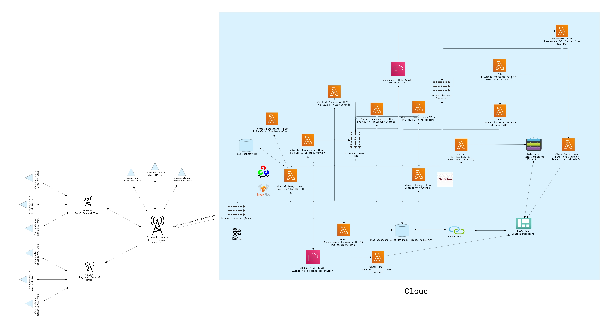
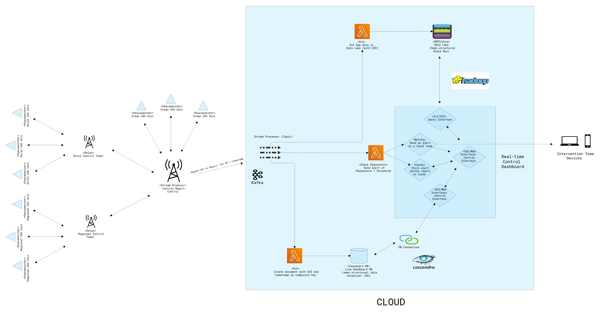
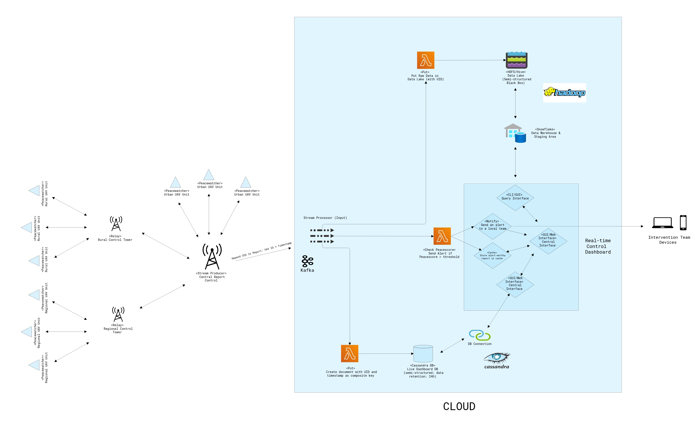

# Scala Example Exercises - Drone Cloud Architecture Project

Team members:

    Ivan STEPANIAN
    Omar ALLOUACHE
    Paul DORFFER

# Preliminary Questions:

## 1) What technical/business constraints apply to the data storage component so that statistical analysis can be easily achieved on the database with a daily data rate of 200GB ?   

    So that easy, automated and improvized statistical analyses can be done on the database, it must be quickly queryable (perhaps via an indexing system and composite keys), fail-safe (assuring availability) and easily scalable. Consistency isn't required, as data modification would be very uncommon in our system: once the data is received, it does not change; so we can go for an AP DBMS, using for example Cassandra. A NoSQL system would be ideal, as they tend to be way more scalable that SQL DBMS, allow for more freedom in terms of data structure and are optimized for cloud architectures.

    The data for the alarm system and real-time database is hot, while it is much colder for the statistical analysis service. We can thus split our DBMS system into two databases: a cold horizontally scalable data lake and a hot vertically scalable database, with direct access to compute resources. We can consider that the data warehouse will only have a data retention limit of 200GB of reports, or one day's worth of reports. If the daily rate must be greatly increased, we can either vertically scale the resources or have a lower retention time. The data lake will keep all data permanently, at the cost of query efficiency. If a large statistical service, working permanently on data analytics, we can create a warm data warehouse, conserving structured statistics, large query results and intermediary analytics, so as to have already partially pre-processed queries. If the statistics are irregularly queried and do not require to be obtained critically quickly, this third DBMS is unnecessary.

    The hot database can be duplicated across multiple hot nodes, or at least a few cold nodes, in order to assure availability. Since hot compute/storage is very expensive, the duplication factor should be low. The DBMS used would likely be Cassandra. The data lake doesn't require complete availability, as the data is non-critical. For this reason, we can use a simple HDFS/Hive DBMS. However, the rather small individual reports should be compiled into Sequences or larger compiled reports (without data loss) by date, drone, or situational identifiers, as to avoid having many small files and indices in the HDFS/DBMS system.

## 2) What business constraint should the architecture meet to be able to quickly alert human personnel in case of emergency ?

    As mentioned before, the data used by the dashboard is very hot and should be very quickly queryable & always available. As for the alert in itself, it should be raised in a parallel process than the dashboard/DBMS. To have those parallel processes running on the same architecture, we can use a stream with the DMBS & a simple checking function as the stream's consumers. If a drone report is found to be alarming, the report is directly transferred to a special part of the Dashboard, where an alert notification is sent and the report is stored in cache, while it is then added to the database in the other slower process. Since the check function is extremely simple, it can process all incoming events very quickly. As mentioned before, the architecture should be scalable in an "on-demand" manner, were resources needn't be available 24/7 as the data flow has varying traffic and retention.

## 3) What mistake(s) from the previous team can explain their failed attempt?

    - The team probably used Python as their programming language of choice (Python is one of the most common POC-oriented programming language). Python tends to be slow, doesn't support functional programming well and is highly fragmented (relies a lot on libraries); Scala is generally more scalable than Python
    - The team perhaps failed to realize a scalable program because the DBMS and general architecture might not have been ideal for scaling
    - The team perhaps failed to scale their program because horizontal scaling (adding new nodes) was discouraged
    - The team perhaps failed to realize the importance of having flexible resources, depending on daily data rates, to be able to deal with data traffic spikes

## 4) Some technical information is likely missing in the report sent by the drones. This information might make the personnel much more efficient. What is it?

    - A timestamp of the report (or a simply report id appended to the drone id, which can identify the time of the report, knowing a report is sent every minute). Knowing at what time the report was sent could help prioritize which situations must be dealt with ASAP.
    - The drone state: is the drone active, damaged, running out of battery. If the drones can receive orders from the base, the drones could be retrieved if they are in danger of being destroyed/breaking down or not retrieved if the state is judged non critical by human operators.
    - Other contextual information to be able to classify the different types of critical situations, and whether some require medical assistance, a larger force deployed than usual or the deployment of special forces.
    - A certainty rate for every data elements processed by the internal intelligence of the drone, as to avoid false positives and to better assess the risk and importance of an alert.
    - To reduce the number of redundant reports sent by the same drone, a special flag could be added to the reports indicating whether the current situation being observed is the same as the one observed by the previous report. Some intelligence should also be added to the cloud architecture to deal with redundant reports from multiple drones in the same area.

# Scalable UAV System: architectures

Example of an architecture with UAVs without internal intelligence (stream inputs are short videos)

Example of an architecture with UAVs with internal intelligence (stream inputs are preprocessed reports)

Example of an architecture with UAVs with internal intelligence & a statistics warehouse (stream inputs are preprocessed reports)

